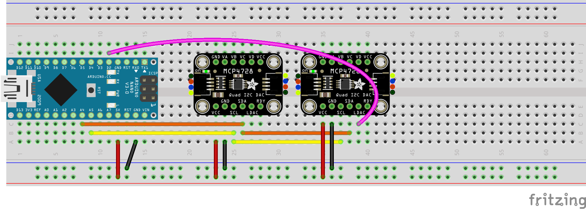
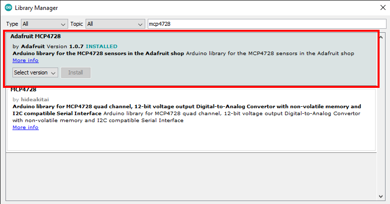

# LaserDiodeDriver

[](https://github.com/john-wigg/LaserDiodeDriver/actions)
[](https://github.com/john-wigg/LaserDiodeDriver/actions)

This [Micro-Manager](https://github.com/micro-manager/micro-manager) device adapter is part of a project by Daniel Schröder at the FSU Jena and can be used to control laser diodes. Both the [Velleman K8061](https://www.velleman.eu/products/view/?lang=en&id=364910) as well as a setup using an [Arduino](https://www.arduino.cc/) together with two [MCP4728](https://www.adafruit.com/product/4470) DACs can be used with the adapter.

The adapter uses the [comedi](https://www.comedi.org/) library to communicate with the Velleman K8061. Thus, on Windows the Velleman K8061 is not supported. However, the adapter can still be used with the Arduino setup.

## EMU interface

An [EMU](https://micro-manager.org/wiki/EMU) plugin designed to be used with this adapter is available at https://github.com/john-wigg/LaserDiodeDriverUI.

## Table of contents
* [Known issues](#known-issues)
* [Prerequisites](#prerequisites)
* [Build instructions](#build-instructions-tested-on-windows-and-linux)
* [Arduino setup](#arduino-setup)
* [Outputs](#outputs)
* [Additional setup (Linux only)](#additional-setup-linux-only)
* [License](#license)

## Known issues

Sometimes, when setting the number of laser diodes, the hardware configuration manager crashes (see [this issue](https://github.com/john-wigg/LaserDiodeDriver/issues/1)). A workaround is to leave the number of diodes at 1 on initial configuration and change the number manually in the generated config file. Note that in order to access the hardware configuration wizard again, an empty configuration may have to be loaded.

## Prerequisites

### Linux

The [comedi](https://www.comedi.org/) library is required to run the Velleman K8061 board on Linux. It can be installed with

`sudo apt-get install libcomedi-dev`


## Build instructions (tested on Windows and Linux)

*Note*: You can find pre-built binaries [here](https://github.com/john-wigg/LaserDiodeDriver/releases).

[CMake](https://cmake.org/) is used as the build system for this device adapter. Below is a breakdown of the build process. It is assumed that Micro-Manager is already installed on your Linux or Windows machine.

1. Clone the Micro-Manager core source:
```
git clone https://github.com/micro-manager/mmCoreAndDevices
```

2. Clone this respository to a directory:
```
git clone https://github.com/john-wigg/LaserDiodeDriver
```

3. Open the LaserDiodeDriver source directory you just cloned:
```
cd LaserDiodeDriver
```

4. Create a build directory and enter it:
```
mkdir build
cd build
```

5. Generate the build files and specify the source directory of the Micro-Manager core:
```
cmake .. -DMMROOT=path/to/mmCoreAndDevices
```
(If the `MMROOT` option is not specified, it is assumed that the `LaserDiodeDriver` directory is located inside the `DeviceAdapters` or `TestDeviceAdapters` directory inside Micro-Manager core's source tree.)

**Note**: If the compilation completes but you get "undefined reference" errors when trying to open the adapter in Micro-Manager, the path to the Micro-Manager core was probably incorrect. Note that if not absolute, paths are relative to the repos root directory (the directory containing `CMakeListst.txt`).

6. Run the build:
```
cmake --build .
```

7. Rename the generated shared library:
```
mv libmmgr_dal_LaserDiodeDriver.so libmmgr_dal_LaserDiodeDriver.so.0
```

**Note**: Skip this step for windows builds.

8. Copy the shared library to the installation directory of Micro-Manager/ImageJ (may require root permissions):
```
cp libmmgr_dal_LaserDiodeDriver.so.0 /path/to/ImageJ
```

**Note**: On Windows, the expected file extension is `.dll` instead of `.so.0`.

9. Run Micro-Manager and create a new hardware configuration with the `LaserDiodeDriver` device adapter.

## Arduino setup

Instead of the expensive Velleman K8061, it is also possible to use a cheaper setup consisting of an Arduino connected to two [MCP4728](https://learn.adafruit.com/adafruit-mcp4728-i2c-quad-dac) DACs. The following instructions will walk you through the process of building the setup on a breadboard and configuring the Arduino. The examples assume that you are using an [Arduino Nano](https://store.arduino.cc/arduino-nano), however, other boards should work as well.

1. Connect the `SDA` and `SCL` pins of the two MACP4728s to the corresponding pins of the Arduino (`A4` and `A5`, respectively on the Arduino Nano). Connect the `VCC` pins to the `5V` pin of the Arduino and tie all `GND` pins together. For the initial setup, also connect the `LDAC` pin of *one* MCP4728 to the `D2` pin. The complete Fritzing diagram is shown below:



2. Install the [Adafruit_MCP4728](https://github.com/adafruit/Adafruit_MCP4728) library. This can be done directly from the Arduino IDE under `Tools > Manage Libraries...`. Make sure you install the library by *Adafruit*.



3. Download the [arduino_sketches/Setup](arduino_sketches/Setup) directory and upload the `Setup.ino` sketch to your Arduino using the [Arduino IDE](https://www.arduino.cc/en/software). This will set the address of the MCP4728 which has its `LDAC` pin connected to the Arduino (pink wire) to `0x61` so it can be controlled individually.

4. If the setup sketch has executed successfully, you may remove the pink wire connecting the `LDAC` pin to the Arduino.
 
5. Download the [arduino_sketches/Program](arduino_sketches/Program) directory and upload the `Program.ino` sketch to your Arduino.

## Outputs

### Digital Outputs

In Micro-Manager, the digital outputs are numbered `0` to `7`.
On the K8061 board, these will be the digital outputs 1 to 8, in ascending order.
On the Arduino Nano, these will be D2 to D9, in ascending order.

### Analog Outputs

In Micro-Manager, the analog outputs are numbered `0` to `7`.
On the K8061 board, these will be the analog outputs 1 to 8, in ascending order.
On the MCP4728s, these will be the analog outputs A to D, whereas the MCP4728 with address `0x60` (the one closer to the Arduino in the figure above) will correspond to the outputs `0` to `3` and the other MCP4728 will correspond to the outputs `4` to `7`.

## Additional setup (Linux only)

If you want to use the adapter without the need for `sudo`, add a `.rules` file with the following content to `/etc/udev/rules.d/`:

```
KERNEL=="device_name", MODE="0666"
```

where `device_name` is the is the *name* (not path) of the device file, e.g. `comedi0` for the K8061 board and `ttyUSB0` for the Arduino (the trailing `0` may be a different number).

# License

This project is licensed under the [MIT license](LICENSE).

Exempt from this is the `Setup.ino` sketch which uses the [SoftI2cMaster](https://github.com/TrippyLighting/SoftI2cMaster) library and is licensed under the [GNU GPLv3](arduino_sketches/Setup/LICENSE).

The `Setup.ino` sketch has been originally created by Jan Knipper (https://github.com/jknipper/mcp4728_program_address) and is used [with the author's permission](https://github.com/jknipper/mcp4728_program_address/issues/1).

This project uses the [serial](https://github.com/wjwwood/serial) library which is available under the MIT license.
